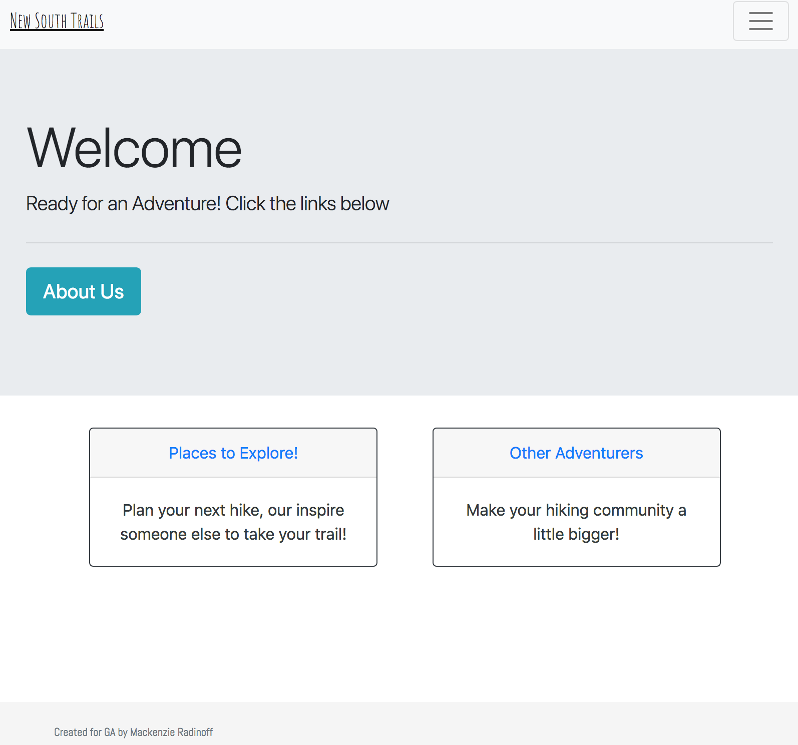

# New South Trails (Project 1)

## Description
A simple tourism-based site using CRUD systems.

## Built With
HTML, CSS, Ruby On Rails, and Bootstrap.

## Known Bugs
* A user that is not signed in can still view accounts
* Display Issues

## To Do List
###
  1. Complete page CSS
  1. Geolocation for trails
  1. API for places (e.g. current conditions and safety concerns)
  1. More Navigation options
  1. Cloudinary (with possibility to add more than one image)
  1. Form Design
  1. Add placeholder text to forms
  1. User following User functionality

## Authors
Mac Radinoff.

## License
This project is licensed under the MIT License - see the LICENSE.md file for details

## Acknowledgments
Thanks to my teachers Joel, John, Theo, and my mentor Miriam.

